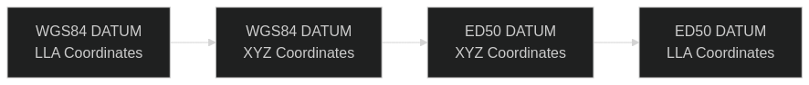

# WGS84 to ED50 Coordinate Converter

This MATLAB project converts geodetic coordinates from the WGS84 datum to the ED50 datum using a 3-parameter transformation (?X, ?Y, ?Z). It supports individual and batch coordinate conversion.

## :arrows_clockwise: Coordinate Transformation Flow

The diagram below shows the step-by-step transformation process from WGS84 to ED50:



- *LLA*: Latitude, Longitude, Altitude
- *XYZ*: Cartesian coordinates
- The conversion applies a simple 3-parameter shift (?X, ?Y, ?Z) in XYZ space between the datums.

## :rocket: How to use

1. Prepare your input data

   Create a file named `data.txt` inside the `data/` folder. Each line must contain:

    - longitude latitude height
    - Longitude and latitude in degrees (WGS84)
    - Height in meters

    *Example*:

    ```
    -3.7038 40.4168 667
    
    -0.3750 39.4699 15
    
    1.5197 41.3825 20
    ```
    
2. Run the example script in MATLAB
    1. Open MATLAB
    2. Navigate to the examples/ folder
    3. Run the script:

    ```
    matlab
    addpath('../src');
    convert_from_file_example
    ```

    This script will:
    - Load the WGS84 coordinates from data/data.txt
    - Convert them to ED50
    - Save the results to data/dataOutput.txt

3. Output format

    The output file will contain:


    longitude_ED50, latitude_ED50, height_ED50


    Example:

    ```
    -3.7048236712, 40.4179612348, 665.32947219
    -0.3760533289, 39.4709981237, 13.75838202
    1.5186032376, 41.3834232125, 18.60388215
    ```

## :pushpin: Notes

- The function is vectorized and supports processing multiple coordinates at once.
- Compatible with base MATLAB (no extra toolboxes required).
- Output is written as a .txt file but can easily be adapted to .csv.


## :page_with_curl: License

This project is licensed under the [MIT License](LICENSE).


## :astronaut: Credits

Created to assist in geospatial coordinate transformations between WGS84 and ED50 datums.